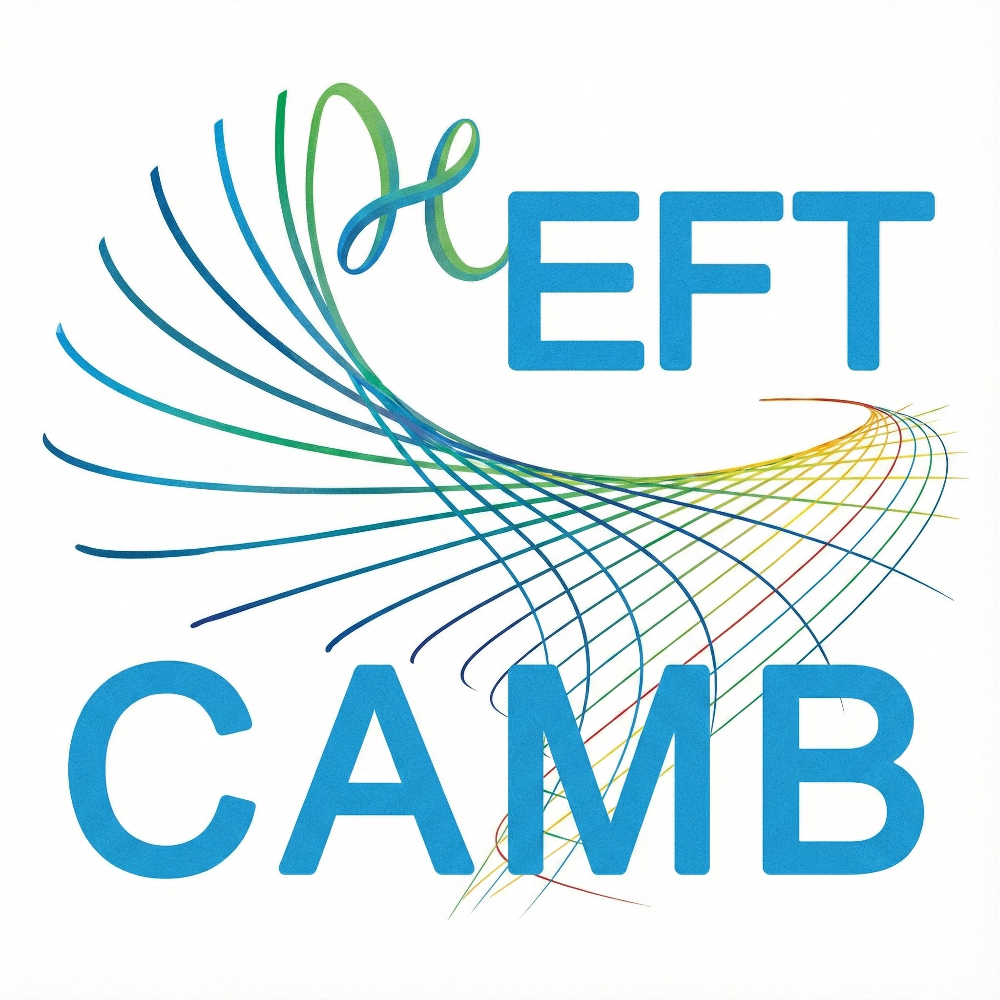

H-EFTCAMB
=======



[](https://travis-ci.org/EFTCAMB/EFTCAMB)

This folder contains the H-EFTCAMB code.

### 1. A Direct Installation Procedure:

Before installation, make sure you have the following dependencies installed:

  - gfortran
  - gcc
  - lapack

By default, the blas and lapack library is linked by ``-lblas -llapack``. If a custom library is used, change the variables ``BLASFLAG`` and ``LAPACK_FLAG`` in ``fortran/Makefile`` to point to your local blas and lapack library. The python wrapper further requires the following python packages:

  - python3
  - numpy
  - sympy
  - scipy
  - packaging

For example, using conda, you can create a new environment and install the required packages with the following command:

    conda create -n HEFTCAMB_env gfortran gcc lapack numpy python sympy scipy packaging -c conda-forge

Clone the H-EFTCAMB code using

```
git clone https://github.com/EFTCAMB/EFTCAMB.git --recursive
```

and navigate to the package directory and compile the code by typing:

    cd fortran
    make all

This will compile both the ``camb`` executive and the python wrapper. The executive and python wrapper are independent of each other. If you intend to call H-EFTCAMB only through python (recommended), you can compile the python wrapper only by ``make python``. The compiled python library locates in the folder ``camb`` in the root directory and can be imported in the same way as the original ``CAMB`` by

```
import camb
```

**Note for Mac Users:**
If you're using a Mac with an Apple Silicon chip (e.g., M1, M2), make sure you install the appropriate version of fortran and C compilers for your architecture (arm64), for example:

    conda create -n HEFTCAMB_env gfortran_osx-arm64 clang_osx-arm64 lapack numpy python sympy scipy packaging -c conda-forge

and set the environment variable ``CC`` to point to the correct C compiler before installation. You can check the versions by typing `gfortran -v` and `clang -v`. Make sure that your python3 is compiled with the same C compiler.


### 2. Documentation:

The contents of H-EFTCAMB are listed in this chart:


We provide a set of notes that contain all the details and formulas of the EFTCAMB implementation:

* *EFTCAMB/EFTCosmoMC: Numerical Notes v3.0*
    Bin Hu, Marco Raveri, Noemi Frusciante, Alessandra Silvestri, [arXiv:1405.3590 [astro-ph.CO]](http://arxiv.org/abs/1405.3590)

with the new additions to H-EFTCAMB described in:

* *H-EFTCAMB: A Cobaya-Integrated, Python-Wrapped Extension of EFTCAMB for Covariant Horndeski Gravity*
    Gen Ye, Shijie Lin, Jiaming Pan, Dani de Boe, Stan Verhoeve, Marco Raveri, Bin Hu, Noemi Frusciante, Alessandra Silvestri, [arXiv:2603.01662 [gr-qc]](https://arxiv.org/abs/2603.01662)

The H-EFTCAMB source files documentation is automatically built at any modification of the code and can be found at [this link](https://eftcamb.github.io/EFTCAMB/).

Besides above documentation, there are several flowchart or markdown files helping you easily find your model flags and set parameters in “find_your_model" folder.

### 3. Examples and Usage with Cobaya:

The H-EFTCAMB distribution contains a folder called ``example`` containing some example notebooks demonstrating how to setup and run various dark energy / modified gravity models and extract results for analysis using the python wrapper. The folder also contains several example Cobaya input files demonstrating how to analyze dark energy / modified gravity models with H-EFTCAMB in Cobaya.

For further instructions on the usage of Cobaya, refer to the its documentation at: https://readthedocs.org/projects/cobaya/badge/?version=latest

### 4. Citing this work:

If you use the EFTCAMB/EFTCosmoMC package, please refer the original CAMB paper and ours:

* *Effective Field Theory of Cosmic Acceleration: an implementation in CAMB*
    Bin Hu, Marco Raveri, Noemi Frusciante, Alessandra Silvestri,
    [arXiv:1312.5742 [astro-ph.CO]](http://arxiv.org/abs/1312.5742) [Phys.Rev. D89 (2014) 103530](http://journals.aps.org/prd/abstract/10.1103/PhysRevD.89.103530)


* *Effective Field Theory of Cosmic Acceleration: constraining dark energy with CMB data*
    Marco Raveri, Bin Hu, Noemi Frusciante, Alessandra Silvestri,
    [arXiv:1405.1022 [astro-ph.CO]](https://arxiv.org/abs/1405.1022) [Phys.Rev. D90 (2014) 043513](http://journals.aps.org/prd/abstract/10.1103/PhysRevD.90.043513)


* *H-EFTCAMB: A Cobaya-Integrated, Python-Wrapped Extension of EFTCAMB for Covariant Horndeski Gravity*
    Gen Ye, Shijie Lin, Jiaming Pan, Dani de Boe, Stan Verhoeve, Marco Raveri, Bin Hu, Noemi Frusciante, Alessandra Silvestri, [arXiv:2603.01662 [gr-qc]](https://arxiv.org/abs/2603.01662)

This is the usual, fair way of giving credit to contributors to a
scientific result. In addition, it helps us justify our effort in
developing the H-EFTCAMB code as an academic undertaking.

### 5. Licence Information:

H-EFTCAMB is a modification of the CAMB code.
The code part of CAMB that is not modified is copyrighted by the CAMB authors and released under their licence.

For the part of code that constitutes H-EFTCAMB see the LICENSE file in ``eftcamb/LICENSE``.

### 6. Build system target:

In addition to CAMB makefile targets H-EFTCAMB comes with the additional:

* ``eftcamb``: to compile H-EFTCAMB;
* ``eftcamb_apps``: to compile H-EFTCAMB applications like the benchmarker;
* ``eftcamb_dep``: to automatically sort out H-EFTCAMB source file dependencies;
* ``eftcamb_doc``: to build the H-EFTCAMB automatic documentation;
* ``intel_profile``: to compile H-EFTCAMB with the options that allow profiling with the VTUNE profiler;
* ``profile``: to compile H-EFTCAMB with the options that allow general profiling;

### 7. H-EFTCAMB source files:

In the folder ``eftcamb`` all the source files for H-EFTCAMB are stored.
In an effort to have small and readable files the the naming convention allows to have an
intuition of the hierarchy of the code from alphabetical order of files.

For this reason we use the following convention for the prefixes:

* ``01_`` compile time utilities;
* ``02_`` pure and general purpose algorithms;
* ``03_`` EFTCAMB cache containing the storage for all cosmological quantities of interest;
* ``04_`` general parametrizations for 1D functions;
* ``05_`` general parametrizations for 2D functions;
* ``06_`` abstract implementation of EFT models;
* ``07_`` implementation of models that requires input background;
* ``08_`` implementation of models that solves for the background;
* ``09_`` general EFT algorithms (RGR, stability, init);
* ``10_`` EFT background output support;
* ``11_`` implementation of functions exposed to the python wrapper;

If you modify or add one or more files make sure to issue ``make eftcamb_dep`` before compiling the code to ensure that all dependencies are properly sorted out and built.